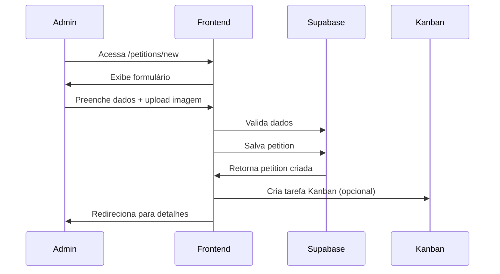
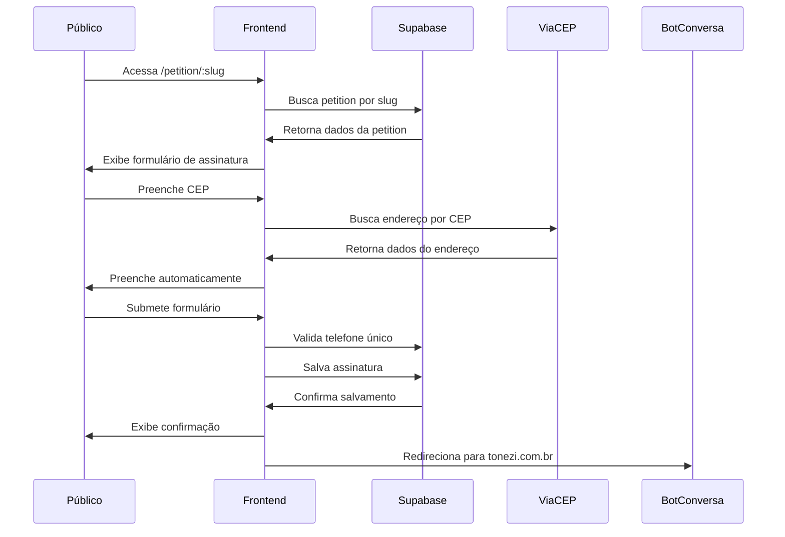
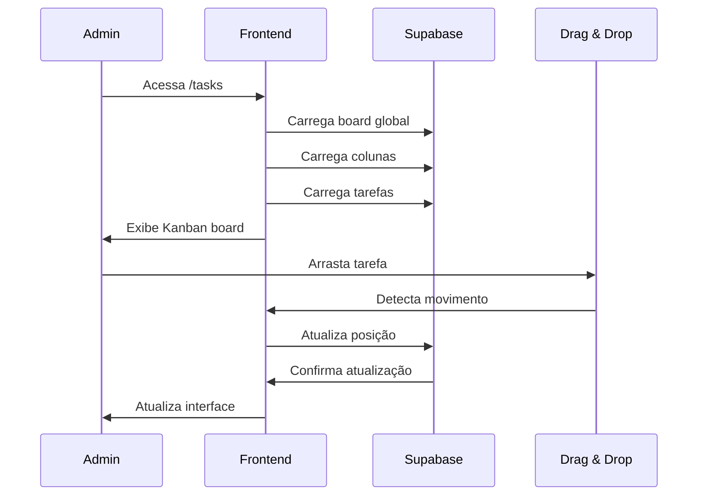

# 🏗️ ARQUITETURA DO SISTEMA - GESTOR DE ABAIXO-ASSINADO

## 📊 VISÃO GERAL DA ARQUITETURA

```mermaid
graph TB
    subgraph "🌐 Frontend (React + TypeScript)"
        A[App.tsx] --> B[AuthContext]
        A --> C[ThemeContext]
        A --> D[ProtectedRoute]
        A --> E[Layout]
        
        E --> F[Dashboard]
        E --> G[PetitionList]
        E --> H[CreatePetition]
        E --> I[PetitionDetail]
        E --> J[Tasks - Kanban]
        E --> K[Settings]
        
        L[PublicPetition] --> M[Formulário de Assinatura]
        M --> N[Validação LGPD]
        M --> O[Integração ViaCEP]
    end
    
    subgraph "🔧 Utilitários"
        P[validation.ts] --> Q[Validação de Telefone]
        P --> R[Validação de Nome]
        S[export.ts] --> T[Exportação CSV]
        U[whatsapp-utils.ts] --> V[Formatação BotConversa]
        W[supabase-storage.ts] --> X[Operações CRUD]
    end
    
    subgraph "🗄️ Backend (Supabase)"
        Y[PostgreSQL] --> Z[petitions]
        Y --> AA[signatures]
        Y --> BB[admin_users]
        Y --> CC[kanban_boards]
        Y --> DD[kanban_columns]
        Y --> EE[kanban_tasks]
        Y --> FF[kanban_comments]
        
        GG[Auth] --> HH[Login/Logout]
        GG --> II[Verificação Admin]
        
        JJ[Storage] --> KK[Upload de Imagens]
    end
    
    subgraph "🌍 Serviços Externos"
        LL[ViaCEP API] --> MM[Busca de Endereço]
        NN[BotConversa] --> OO[Integração WhatsApp]
        PP[Netlify] --> QQ[Deploy Frontend]
    end
    
    A --> GG
    F --> X
    G --> X
    H --> X
    I --> X
    J --> X
    K --> X
    M --> X
    M --> LL
    X --> Y
    X --> GG
    X --> JJ
    T --> NN
```

## 🔄 FLUXOS PRINCIPAIS

### 1. 📝 CRIAÇÃO DE ABAIXO-ASSINADO (Admin)

### 2. 🌐 ASSINATURA ONLINE (Público)

### 3. 📊 GESTÃO KANBAN (Admin)

## 🗄️ ESTRUTURA DO BANCO DE DADOS

### 📋 Tabelas Principais

#### `petitions`
- **id**: UUID (PK)
- **slug**: Texto único para URL
- **name**: Nome do abaixo-assinado
- **description**: Descrição detalhada
- **location**: Local de coleta
- **collection_date**: Data da coleta física
- **responsible**: Responsável pela coleta
- **image_url**: URL da imagem
- **available_online**: Boolean (disponível online)
- **table_name**: Nome da tabela de assinaturas
- **created_at/updated_at**: Timestamps

#### `signatures`
- **id**: UUID (PK)
- **petition_id**: UUID (FK para petitions)
- **name**: Nome completo
- **phone**: Telefone celular
- **street**: Rua/endereço
- **neighborhood**: Bairro
- **city**: Cidade
- **state**: Estado (UF)
- **zip_code**: CEP
- **mensagem_enviada**: Boolean (WhatsApp enviado)
- **created_at**: Timestamp

#### `admin_users`
- **id**: UUID (PK)
- **user_id**: UUID (FK para auth.users)
- **email**: Email do administrador
- **created_at**: Timestamp

### 🎯 Tabelas Kanban

#### `kanban_boards`
- **id**: UUID (PK)
- **name**: Nome do board
- **is_global**: Boolean (board global)
- **created_at/updated_at**: Timestamps

#### `kanban_columns`
- **id**: UUID (PK)
- **board_id**: UUID (FK para kanban_boards)
- **name**: Nome da coluna
- **position**: Posição da coluna
- **created_at/updated_at**: Timestamps

#### `kanban_tasks`
- **id**: UUID (PK)
- **board_id**: UUID (FK para kanban_boards)
- **column_id**: UUID (FK para kanban_columns)
- **petition_id**: UUID (FK para petitions, opcional)
- **title**: Título da tarefa
- **description**: Descrição
- **priority**: Prioridade (low/medium/high)
- **position**: Posição na coluna
- **due_date**: Data de vencimento
- **is_archived**: Boolean (arquivada)
- **created_by**: UUID (FK para auth.users)
- **created_at/updated_at**: Timestamps

## 🔐 SEGURANÇA E AUTENTICAÇÃO

### 🛡️ Row Level Security (RLS)
- **petitions**: Leitura pública, escrita apenas para autenticados
- **signatures**: Leitura pública, escrita pública, edição apenas para autenticados
- **admin_users**: Acesso apenas para autenticados
- **kanban_***: Acesso apenas para autenticados

### 🔑 Sistema de Administradores
- Lista hardcoded de IDs de administradores
- Verificação no AuthContext
- Acesso total ao sistema administrativo

## 🌐 INTEGRAÇÕES EXTERNAS

### 📍 ViaCEP
- **Endpoint**: `https://viacep.com.br/ws/{cep}/json/`
- **Uso**: Preenchimento automático de endereço
- **Validação**: CEP com 8 dígitos

### 📱 BotConversa
- **Formato**: `+55{DDD}{Número}`
- **Validação**: Números celulares com 9º dígito
- **URL**: `https://app.botconversa.com.br/68827/live-chat/all/{telefone}`

### 🚀 Netlify
- **Deploy**: Automático via GitHub
- **Build**: `npm run build`
- **Publish**: `dist/`
- **Redirects**: SPA routing

## 📱 FUNCIONALIDADES PWA

### 🔧 Service Worker
- Cache de recursos estáticos
- Funcionamento offline básico
- Atualizações automáticas

### 📱 Manifest
- Ícones para diferentes tamanhos
- Tema e cores personalizadas
- Instalação como app

## 🧪 TESTES E QUALIDADE

### 🧪 Jest + Testing Library
- Testes de componentes
- Testes de utilitários
- Cobertura de código

### 🔍 ESLint
- Configuração TypeScript
- Regras React
- Formatação consistente

## 📊 MÉTRICAS E MONITORAMENTO

### 📈 Dashboard
- Total de abaixo-assinados
- Total de assinaturas
- Mensagens enviadas/não enviadas
- Abaixo-assinados recentes

### 📋 Relatórios
- Exportação CSV
- Filtros e busca
- Paginação

## 🔄 FLUXO DE DADOS

### 📤 Entrada de Dados
1. **Admin**: Cria abaixo-assinado via interface
2. **Público**: Assina via formulário público
3. **Admin**: Digitaliza assinaturas físicas

### 📥 Processamento
1. **Validação**: Dados obrigatórios e formato
2. **Verificação**: Telefones únicos por petition
3. **Armazenamento**: PostgreSQL via Supabase

### 📤 Saída de Dados
1. **Exportação**: CSV para análise
2. **WhatsApp**: Integração BotConversa
3. **Relatórios**: Dashboard e métricas

## 🚀 DEPLOY E INFRAESTRUTURA

### 🌐 Frontend (Netlify)
- **Build**: Vite + React
- **Deploy**: Automático via Git
- **CDN**: Global
- **SSL**: Automático

### 🗄️ Backend (Supabase)
- **Database**: PostgreSQL
- **Auth**: Supabase Auth
- **Storage**: Supabase Storage
- **API**: REST + Realtime

### 🔧 Desenvolvimento
- **Local**: Supabase CLI
- **Ambiente**: Docker containers
- **Migrações**: SQL versionado

